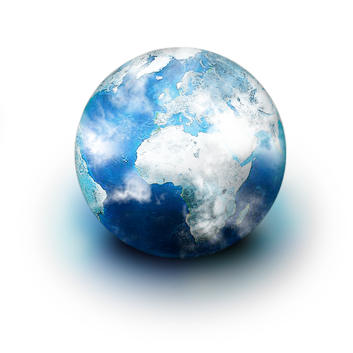

!SLIDE center

!SLIDE

# Geolocation #

!SLIDE bullets

## Features
* Location, location, location
* Old school
* Polling / Watch

!SLIDE

## Methods

	@@@ javascript
	var nav = navigator;

	nav.geolocation.getCurrentPosition(fn);

	nav.geolocation.watchPosition(fn)

	nav.geolocation.clearWatch(watchID);

	
!SLIDE geolocation

<button id="maps-locate">Find me</button>

