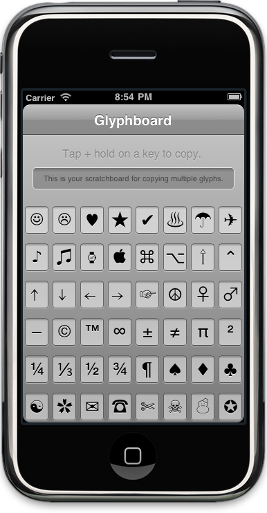

!SLIDE center

!SLIDE

# Offline Webapps #

!SLIDE

	@@@ html
	<html manifest="cache-manifest.manifest"> 

!SLIDE center

!SLIDE center

!SLIDE center

!SLIDE

## Events ##

	@@@ javascript
	window.addEventListener('online',
		onOnlineCallback, false);
	window.addEventListener('offline',
		onOfflineCallback, false);

<a href="http://html5demos.com/offline-events" target="_blank" class="demo">Demo (in Firefox)</a>		