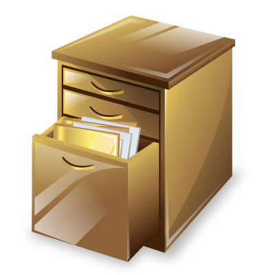

!SLIDE center

!SLIDE

# History

!SLIDE bullets

# History
## Features
* No more fragments #/?awesome=true
* Manipulate browser history
* State object + events

!SLIDE

## Methods

	@@@ javascript
	window.history.pushState(state, title,
		url);
		
	window.history.replaceState(state, title,
		url);

	window.onpopstate = function(e) {
		// e.state
	};

!SLIDE execute

	@@@ javascript
	window.onpopstate = function(event) {
		alert(
			document.location + ",
			state: " + JSON.stringify(event.state)
		);
	};
	history.pushState({page: 1},
		"title 1", "/push/history/1");
	history.pushState({page: 2},
		"title 2", "/push/history/2");
	history.replaceState({page: 3},
		"title 3", "/push/history/3");

<button id="push-history-button-1">run 1</button>
<button id="push-history-button-2">run 2</button>
<button id="push-history-button-3">run 3</button>

!SLIDE

<a href="http://www.flickr.com/photos/auchenberg/5380850160/lightbox/" target="_blank" class="demo"> flickr </a>
<a href="https://github.com/auchenberg/css-reloader/tree/master/google%20chrome" target="_blank" class="demo"> github </a>

# Demo
## push the history

