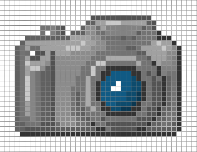

!SLIDE section

# Multimedia / Graphics #

!SLIDE

# Canvas #

!SLIDE center

## pixels ##

!SLIDE execute

	@@@ javascript
	var canvasContext = document
	.getElementById("canvas")
	.getContext("2d");

	canvasContext.fillRect(250, 25, 150, 100);
	canvasContext.beginPath();

	canvasContext.arc(450, 110, 100,
	Math.PI * 1/2,
	Math.PI * 3/2);
	
	canvasContext.lineWidth = 15;
	canvasContext.lineCap = 'round';
	canvasContext.strokeStyle =
	'rgba(255, 127, 0, 0.5)';

	canvasContext.stroke();

!SLIDE execute

<canvas id="canvas" width="700" height="225"></canvas>

!SLIDE center

# MakeItBounce #
## Demo ##

<a target="_blank" href="http://kenneth.io/experiments/makeitbounce/" class="demo">Bouncing Logo</a>