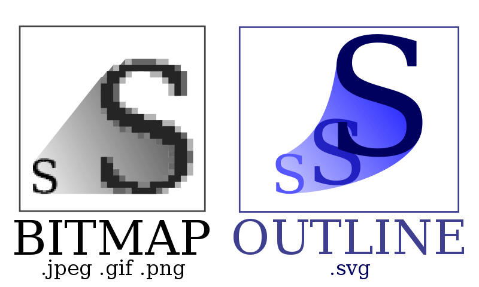

!SLIDE section

# SVG
## Scalable Vector Graphics

!SLIDE center

!SLIDE bullets
# SVG
## Scalable Vector Graphics

* Been around since 1999
* VML vs. SVG
* Indexable

!SLIDE

	@@@ html
	<svg width="300px" height="300px">
		<defs>
			<linearGradient id="myGradient" x1="0%" y1="100%" x2="100%" y2="0%">
				<stop offset="5%" stop-color="red"></stop>
				<stop offset="95%" stop-color="blue" stop-opacity="0.5"></stop>
			</linearGradient>
		</defs>

		<circle cx="50%" cy="50%" r="100"
			fill="url(#myGradient)" stroke-color="red">
		</circle>
	</svg>
	
<svg width="300px" height="300px"><defs><linearGradient id="myGradient" x1="0%" y1="100%" x2="100%" y2="0%"><stop offset="5%" stop-color="red"></stop><stop offset="95%" stop-color="blue" stop-opacity="0.5"></stop></linearGradient></defs><circle cx="50%" cy="50%" r="100" fill="url(#myGradient)" stroke-color="red"></circle></svg>