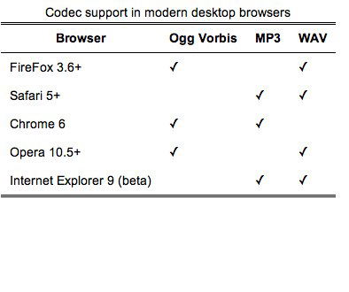

!SLIDE

# &lt;video&gt; #
## in the browser ##

!SLIDE

# Markup #

	@@@ html
	<video controls preload="metadata"
		autobuffer autoplay poster loop>
		<source src="elvis.m4v" />
		<source src="elvis.ogg" />
	</video>
	
!SLIDE bullets

## Why built-in? ##
 * Natural
 * Control
 * Accessibility

!SLIDE smbullets chart

# Codecs #
## Let the battle begin ##

<table class="chart">
	<thead>
		<tr>
			<th>Browser</th>
			<th style="width: 15%;">Ogg Theora</th>
			<th style="width: 15%;">H.264</th>
			<th style="width: 15%;">WebM</th>
		</tr>
	</thead>
	<tbody>
		<tr>
			<td>Internet Explorer</td>
			<td style="background:#ff9090; color:black; vertical-align: middle; text-align: center;" class="table-no">No</td>
			<td style="background: #fdd; color: black; vertical-align: middle; text-align: center;" class="nightly table-nightly">9.0</td>
			<td style="background: #FED; color: black; vertical-align: middle; text-align: center;" class="depends table-depends">plugin</td>
		</tr>

		<tr>
			<td>Mozilla Firefox</td>
			<td style="background: #90ff90; color: black; vertical-align: middle; text-align: center;" class="table-yes">3.5</td>
			<td style="background:#ff9090; color:black; vertical-align: middle; text-align: center;" class="table-no">No</td>
			<td style="background: #fdd; color: black; vertical-align: middle; text-align: center;" class="nightly table-nightly">4.0</td>
		</tr>

		<tr>
			<td>Google Chrome</td>
			<td style="background: #90ff90; color: black; vertical-align: middle; text-align: center;" class="table-yes">3.0</td>
			<td style="background:#ff9090; color:black; vertical-align: middle; text-align: center;" class="table-no">No (deprecated)</td>
			<td style="background: #90ff90; color: black; vertical-align: middle; text-align: center;" class="table-yes">6.0</td>
		</tr>

		<tr>
			<td>Safari</td>
			<td style="background:#ff9090; color:black; vertical-align: middle; text-align: center;" class="table-no">No</td>
			<td style="background: #90ff90; color: black; vertical-align: middle; text-align: center;" class="table-yes">3.1</td>
			<td style="background: #FED; color: black; vertical-align: middle; text-align: center;" class="depends table-depends">plugin</td>
		</tr>

		<tr>
			<td>Opera</td>
			<td style="background: #90ff90; color: black; vertical-align: middle; text-align: center;" class="table-yes">10.50</td>
			<td style="background:#ff9090; color:black; vertical-align: middle; text-align: center;" class="table-no">No</td>
			<td style="background: #90ff90; color: black; vertical-align: middle; text-align: center;" class="table-yes">10.60</td>
		</tr>
	</tbody>
</table>

!SLIDE center

<video width="192" height="304" src="http://static.vodafone360.com/videos/V360_Hori_Android_PEOPLE_192x304_UK.mp4" type="video/mp4" controls="true"></video>

## In action ##

!SLIDE

# &lt;audio&gt; 

!SLIDE

# Markup #

	@@@ html
	<audio controls preload="metadata"
		autobuffer autoplay loop>
		<source src="elvis.mp3" />
		<source src="elvis.ogg" />
	</audio>

!SLIDE center

# Codecs #
## Let the battle begin ##

