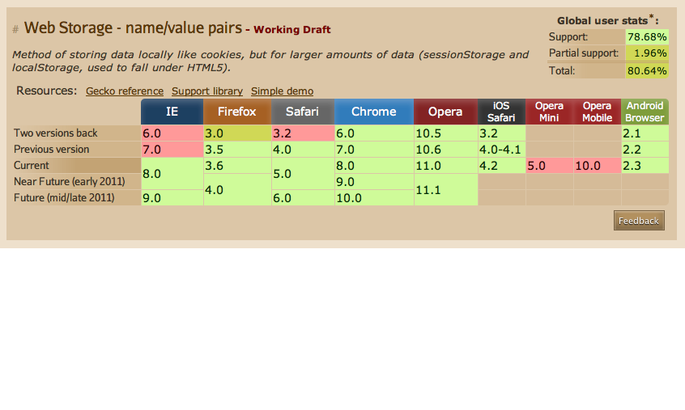

!SLIDE section

# Which browser supports what?

!SLIDE center

## caniuse.com

!SLIDE section
# Resources

!SLIDE bullets

# More info at

* [Dive into HTML5](http://diveintohtml5.org)
* [HTML5 Demos](http://html5demos.com/)
* [HTML5 Rocks](http://html5rocks.com/)
* [HTML5 Doctor](http://html5doctor.com/)
* [Can I Use?](http://caniuse.com/)

!SLIDE section thanks

<h1>Thanks</h1>

