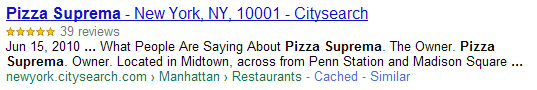

!SLIDE section

# Semantics #

!SLIDE

# custom data attributes #
## store custom data ##

	@@@ html
	

       
!SLIDE

# links #
## references ##

	@@@ html
	<a rel="archives" …>
	<a rel="author" …>
	<a rel="bookmark" …>
	<a rel="external" …>
	<a rel="noreferer" …>
	<a rel="pingback" …>
	<a rel="prefetch" …>
	<a rel="search" …>
	<a rel="license" …>
	<a rel="prev" …>
	<a rel="next" …>				
	<link rel="icon" …>

!SLIDE

# favicon 2.0 #
## Google Chrome (iphone) ##

	@@@ html
	<link rel="icon" href="gmail_48x48.png"
	sizes=48x48" />	
  
!SLIDE

# sections

	@@@html
	<section>
	<nav>
	<menu>
	<command>
	<aside>
	<article>
	<header>
	<footer>

!SLIDE
## nav
	@@@ html
	<nav>
	  <ul>
	    <li><a href="#">home</a></li>
	    <li><a href="#">blog</a></li>
	    <li><a href="#">gallery</a></li>
	    <li><a href="#">about</a></li>
	  </ul>
	</nav>

	<section class="content">
	...
	</section>

!SLIDE
## menu, command

	@@@ html
		<menu type="toolbar">
		 <li>
			<menu label="File">
			 <button type="button">New...</button>
			 <button type="button">Open...</button>
			 <button type="button">Save</button>
			 <button type="button">Save as...</button>
			</menu>
		 </li>
		</menu>

!SLIDE
## article, header, footer
	@@@ html
	<article>
	  <header>
	    <h1>Kenneth Auchenberg</h1>
	  </header>
	  
Lorem ipsum blah blah…

		<footer>
			&copy; 2010, me
		</footer>
	</article>

!SLIDE
## aside
	@@@ html
	<article>
		....

		<footer>
		</footer>

		<aside>
		 <h1>Switzerland</h1>
		 
Switzerland, a land-locked country in the middle of geographic
		 Europe, has not joined the geopolitical European Union, though it is
		 a signatory to a number of European treaties.

		</aside>

	</article

!SLIDE

# semantics

	@@@html
	<mark>
	<figure>
	<figcaption>

!SLIDE
## mark
	@@@ html
	
I also have some <mark>kitten</mark>s who are visiting me
	these days. They're really cute. I think they like my garden! Maybe I
	should adopt a <mark>kitten</mark>.

!SLIDE
## figure, figcaption
	@@@ html
	<figure>
	 
	 <figcaption>Bubbles at work</figcaption>
	</figure>

!SLIDE
# Not for historians #
## Gregorian calendar (1582) ##

	@@@ html
	<time datetime="2011-02-27" pubdate>
	  January 27, 2011
	</time>

!SLIDE
#Document outline

	@@@html
	<hgroup>

!SLIDE

	@@@ html
	<section>
        <h1>Why does IE suck?</h1>
        <h2>The reason why...</h2>
	</section>

   
Outline:
   
<pre>
  1. Why does IE suck?
   1.1 The reason why...
</pre>
   
!SLIDE

	@@@ html
	<section>
	  <hgroup>
          <h1>Why does IE suck?</h1>
          <h2>The reason why...</h2>
      </hgroup>  
	</section>

   
Outline:
   
<pre>
  1. Why does IE suck?
</pre>

!SLIDE
# hidden-attribute

	@@@html
	

!SLIDE

	@@@ html
	

      
Scch, this is secret

	</section>

	WRONG:

	[hidden] {
		display: none
	}

!SLIDE
# meter and progress

	@@@html
	<meter />
	<progress />

!SLIDE

	@@@html
	<meter min="0" max="100" low="40" high="90"
		optimum="100" value="91">A+</meter>

<meter min="0" max="100" low="40" high="90" optimum="100" value="91" style="margin: 30px 0 30px 50px; width: 700px;">A+</meter>

	@@@	html
	<progress>working...</progress>

<progress style="margin: 30px 0 30px 50px; width: 700px; ">working...</progress>

	@@@ html
	<progress value="75" max="100">3/4 complete</progress>

<progress value="75" max="100" style="margin: 30px 0 30px 50px; width: 700px; ">3/4 complete</progress>

!SLIDE
# ARIA
## Accessible Rich Internet Applications
	@@@html
	
?

!SLIDE
	@@@html
	<ul aria-role="list">
		..
	</ul>

	<a aria-role="button">
		..
	</a>

!SLIDE
	@@@html
	<button>
	  
	</button>

	<button>
	  
	</button>

!SLIDE
	@@@html
	<button role="button" aria-pressed="false">
	  
	</button>

	<button role="button" aria-pressed="true">
	  
	</button>

!SLIDE
# HTML Microdata
## Machine-readable labels
	@@@html
	
?

!SLIDE center

## Google search

!SLIDE
	@@@html
	

		Pizza Suprema
		Reviewed by Ulysses Grant on Jan 6.
		Delicious, tasty pizza on Eastlake!
		Pizza Suprema serves up traditional wood-fired Neapolitan-style pizza.
		Rating: 4.5
	

!SLIDE
	@@@html
	

		

			Pizza Suprema
			Reviewed by
			Ulysses Grant on

			<time itemprop="dtreviewed" datetime="2009-01-06">
			Jan 6
			</time>.
			
			
				Delicious, tasty pizza in Eastlake!
			

			
				Pizza Suprema serves up traditional wood-fired Neapolitan-style pizza.
			
				
			Rating: 4.5
		

	
