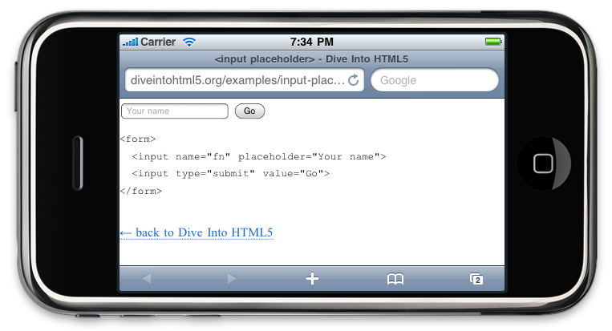
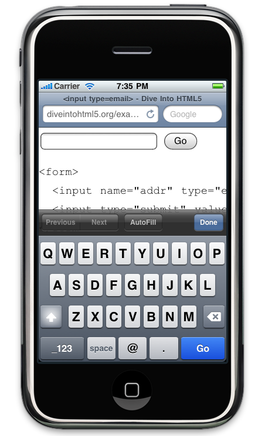
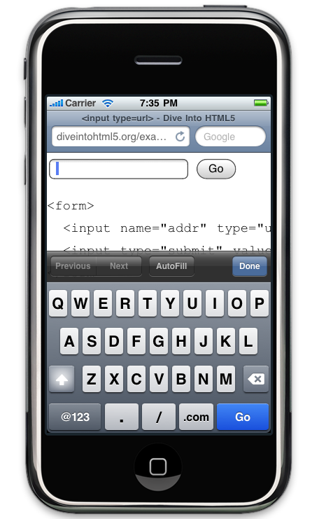
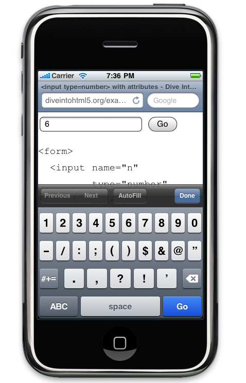
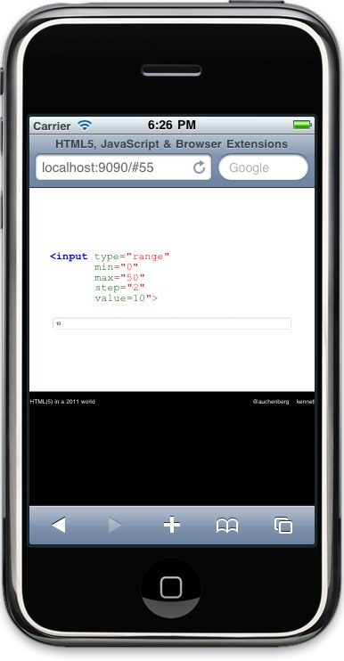
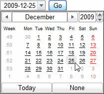

!SLIDE section

# Forms (2.0) #

!SLIDE

## new attributes
	@@@ html
	<input required />
	<input multiple />
	<input pattern="[0-9][A-Z]{3}" />
	<input max="10" min="5" step="2" />

	:invalid { }
	[required] { }

!SLIDE
## placeholder ##

	@@@ html
	<input placeholder="Enter a query" />

<input placeholder="Enter a query" style="width: 800px; height: 30px; font-size: 1em; margin-left: 50px; margin-top: 50px; " />
	
!SLIDE center

!SLIDE
## autofocus ##

	@@@ html
	<input name="q" autofocus>

<a class="demo" href="http://diveintohtml5.org/examples/input-autofocus.html" target="_blank">Click for demo</a>

!SLIDE
## email ##

	@@@ html
	<input type="email" value="some@email.com" />

<input type="email" value="some@email.com" style="width: 800px; height: 30px; font-size: 1em; margin-left: 50px; margin-top: 50px; " />

!SLIDE center

!SLIDE
## url ##

	@@@ html
	<input type="url">

<input type="url" value="http://google.com" style="width: 800px; height: 30px; font-size: 1em; margin-left: 50px; margin-top: 50px; " />

!SLIDE center

!SLIDE
## number ##
	@@@ html
	<input type="number"
	       min="0"
	       max="10"
	       step="2"
	       value="6">

<input type="number" step="2" min="0" max="10" value="6" style="width: 800px; height: 30px; font-size: 1em; margin-left: 50px; margin-top: 50px; " />

!SLIDE center

!SLIDE

## range ##
	@@@ html
	<input type="range"
	       min="0"
	       max="50"
	       step="2"
	       value=10">

<input type="range" min="0" max="50" step="2" value="10" style="width: 800px; height: 30px; font-size: 1em; margin-left: 50px; margin-top: 50px; " />
<input class="custom" type="range" min="0" max="50" step="2" value="10" style="width: 800px; height: 30px; font-size: 1em; margin-left: 50px; margin-top: 20px; " />

!SLIDE center

!SLIDE

## range styled ##
	@@@ html
	input[type=range].custom {
			-webkit-appearance: none;
			background-color: Red;
			width: 200px;
	}

	input[type=range].custom::-webkit-slider-thumb {
			-webkit-appearance: none;
			background-color: Blue;
			opacity: 0.8;
			width: 10px;
			height: 40px;
	}

<input class="custom" type="range" min="0" max="50" step="2" value="10" style="width: 800px; height: 30px; font-size: 1em; margin-left: 50px; margin-top: 130px; " />

!SLIDE

## search ##
	@@@ html
	<input type="search"
	       results="10"
	       placeholder="Search here" />

<input type="search" results="10" placeholder="Search here" style="width: 800px; height: 30px; font-size: 1em; margin-left: 50px; margin-top: 50px; "  />

!SLIDE

## date / time ##
	@@@ html
	<input type="date">
	<input type="month">
	<input type="week">
	<input type="time">
	<input type="datetime">
	<input type="datetime-local">

!SLIDE center

## Opera

!SLIDE

## color ##
	@@@ html
	<input type="color">

